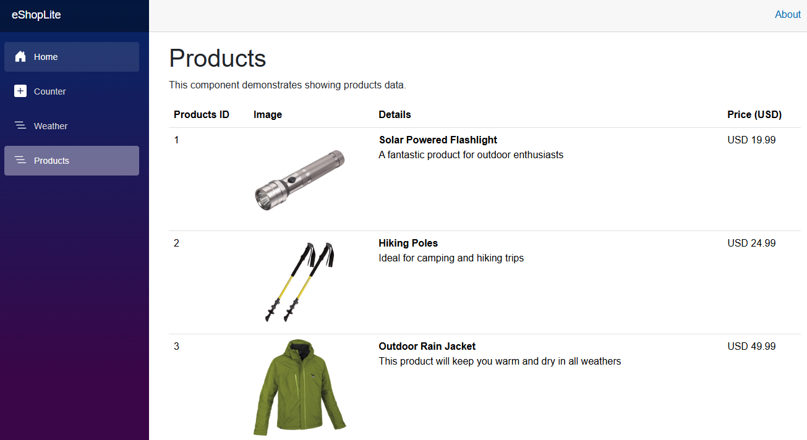

# Running a monolith application on ACA

Azure Container Apps isn't limited to running microservices. In fact, if you're able to containerize a monolith application ACA makes a great service to host it on.

So let's dig in and learn how to containerize and deploy a monolith application (Blazor web app) to [Azure Container Apps (ACA)](https://learn.microsoft.com/azure/container-apps/overview).

## Prerequisites

To run the sample app, make sure you have all the [prerequisites](../README.md#prerequisites).

## Getting started

We'll be doing a lot of work from the command line in this lesson. You can use any terminal you'd like depending on your operating system.

You'll want to open the terminal and change directories to the base of where you cloned or downloaded this repository to.

### Get the repository root

> 📝**NOTE:**
> 
> To simplify the copy paste of the commands that sometimes require an absolute path, we will be using the variable `REPOSITORY_ROOT` to keep the path of the root folder where you cloned/downloaded this repository. The command `git rev-parse --show-toplevel` returns that path.

If you're running on a linux or Mac-based machine or are using bash, run the following:

```bash
# bash/zsh
REPOSITORY_ROOT=$(git rev-parse --show-toplevel)
```

Otherwise if you are using Windows and PowerShell, run this:

```powershell
# PowerShell
$REPOSITORY_ROOT = git rev-parse --show-toplevel
```

### Run the application locally

First off, let's run the application locally - without using a container, just to see what it looks like. To build and run this monolith web app on your local machine, run the following commands in your terminal.

1. Change to this directory.

    ```bash
    cd $REPOSITORY_ROOT/2-monolith-on-aca/sample
    ```

2. Build the app.

    ```bash
    dotnet restore && dotnet build
    ```

3. Run the app.

    ```bash
    dotnet watch run --project ./src/eShopLite.Store
    ```

When the application launches in your web browser, click on the **Products** link from the left menu and you should see a page similar to the following:



### Containerize the Monolith App

Now that we know the app runs locally, let's build a container image of it. We can use `docker build` to do that. Run the following command.

> 🧐**INFO:**
> 
> Make sure you have Docker running!

1. Build the container image using Docker CLI.

    ```bash
    docker build -f ./Dockerfile.store -t eshoplite-store:latest .
    ```

### Run the Monolith App in a Container

Once you have the container image of the monolith app, you can run it in a container.

1. Run the following command to run the monolith app in a container.

    ```bash
    docker run -d -p 8080:8080 --name eshoplite-store eshoplite-store:latest
    ```

1. Check your container is up and running:

    ```bash
    docker ps
    ```

   If the container is up and running, you should see an output similar to the following:

    ```bash
    CONTAINER ID   IMAGE                    COMMAND                  CREATED        STATUS          PORTS                    NAMES
    1b7b4b8b6b6d   eshoplite-store:latest   "dotnet eShopLite.St…"   1 minute ago   Up 1 minute     0.0.0.0:8080->8080/tcp   eshoplite-store
    ```

1. Open your web browser and navigate to `http://localhost:8080` to see the monolith app running in a container. When you click on the **Products** menu item you should see the same products as when you ran the app locally.

### Deploy the monolith application to ACA via the Azure Developer CLI (azd)

Once you're happy with the monolith app running in a container, you can deploy it to ACA through Azure Developer CLI (azd).

The [Azure Developer CLI (azd)](https://learn.microsoft.com/azure/developer/azure-developer-cli/overview) is an open-source tool that accelerates provisioning and deploying app resources on Azure. It provides developer-friendly commands that map to key stages in your development workflow, whether you're working in the terminal, an integrated development environment (IDE), or through CI/CD pipelines. In other words, it makes working with your application and Azure services a lot easier.

1. Make sure that you're in the `ep02/sample` directory.

    ```bash
    cd $REPOSITORY_ROOT/2-monolith-on-aca/sample
    ```

1. Initialize the Azure Developer CLI (azd) with the following command:

    ```bash
    azd init
    ```

1. You'll be prompted **How do you want to initialize your app?** 

    > Choose **Use code in the current directory**. 

1. azd will scan the directory and find projects that are available to deploy. Once it completes its scan you should see output similar to the following:

    ```bash
    azd will generate the files necessary to host your app on Azure using Azure Container Apps.
    ```

    > Select **Confirm and continue initializing my app**.

1. You'll now be asked to provide the environment name. This can be whatever you want and serves as a unique identifier for a specific deployment. It's also used to prefix all the Azure resources created as part of your deployment.

1. Once the initialization is complete, there will be several new files created. One of them is named **azure.yaml** and will be found directly under the **sample** directory. We will need to update that file with the Docker settings to use Azure Container Registry remote build.

    > 🧐**INFO:**
    > Azure Container Registry's remote build feature allows developers to offload container image builds to Azure, enabling cloud-based image creation without requiring local Docker installations. 

    ```yaml
    # azure.yaml
    name: 2-monolith-on-aca
    metadata:
      template: azd-init@1.11.0
    services:
      eshoplite-store:
        project: src/eShopLite.Store
        host: containerapp
        language: dotnet
        # 👇👇👇 Add the docker settings below
        docker:
          path: ../../Dockerfile.store
          context: ../../
          remoteBuild: true
        # 👆👆👆 Add the docker settings above
    ```

1. Finally we'll have azd create the necessary Azure resources and deploy our application for us, all with one single command!

    ```bash
    azd up
    ```

   > 📝**NOTE:**
   > While executing this command, you'll be asked to provide the Azure subscription ID and location.

1. As the Azure resources provision, you'll see a status similar to the following:

    ```bash
    (✓) Done: Resource group: rg-matt-feb25-1437 (1.907s)
    (✓) Done: Log Analytics workspace: log-jyplv7abrwvxa (17.594s)
    (✓) Done: Key Vault: kv-jyplv7abrwvxa (19.211s)
    (✓) Done: Application Insights: appi-jyplv7abrwvxa (2.937s)
    (✓) Done: Container Registry: crjyplv7abrwvxa (25.565s)
    (✓) Done: Portal dashboard: dash-jyplv7abrwvxa (1.453s)
    (✓) Done: Container Apps Environment: cae-jyplv7abrwvxa (52.288s)
    (✓) Done: Container App: eshoplite-store (18.363s)
    ```

1. Once everything is finished, azd will output the URL of the application. Open your web browser and navigate to the URL provided by the ACA instance on the screen to see the monolith app running in ACA.

## Clean up the deployed resources

You are running in Azure and depending on your subscription may be incurring costs. Run the following command to delete everything you just provisioned. (But if you plan on going right to Chapter 3 - you can skip this part!)

```bash
azd down --force --purge
```

## Learn more

- You can learn more about the Azure Developer CLI with [3 hands-on learning modules in Microsoft Learn](https://learn.microsoft.com/training/paths/azure-developer-cli/).

## Up next

Authentication and authorization are topics that are easy in concept, but can be difficult to implement. In the next chapter we'll learn how to implement AuthN/AuthZ with Azure Container Apps.

👉[Authentication on Azure Container Apps](../3-authentication/README.md)
