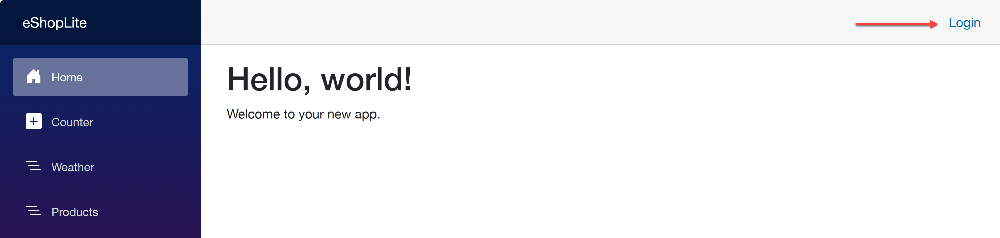

# Extending authentication and authorization on ACA

The built-in [EasyAuth feature](https://learn.microsoft.com/azure/container-apps/authentication) for [Azure Container Apps (ACA)](https://learn.microsoft.com/azure/container-apps/overview) only takes care of your application being protected from unauthenticated visitors. However, in many cases, you want to allow visitors at least to see the landing page without having to login, while the other pages remain protected.

This requires you to add some code for authorization. Let's dig deeper how to augment the built-in EasyAuth feature with applying authorization to individual pages.

## Prerequisites

You have done and completed the [previous chapter](../3-authentication/) that explains the built-in EasyAuth feature.

### Getting the repository root

Initialize the variable `REPOSITORY_ROOT` in your preferred terminal.

```bash
# bazh/zsh
REPOSITORY_ROOT=$(git rev-parse --show-toplevel)
```

```powershell
# PowerShell
$REPOSITORY_ROOT = git rev-parse --show-toplevel
```

### Deploy the application to ACA via Azure Developer CLI (AZD)

> 📝**NOTE**: If you already have an environment from a previous chapter, you can skip this part on deployment.
> 

1. Make sure that you're in the **3-opt-fine-grained-auth** directory.

    ```bash
    cd $REPOSITORY_ROOT/3-opt-fine-grained-auth/sample
    ```

1. Run the following command to deploy a new application to ACA. (We've already provided all the bicep and infrastructure files you need.)

    ```bash
    azd up
    ```

   > 📝**NOTE:**
   > While executing this command, you'll be asked to provide the Azure subscription ID and location.

### Explore the fine-grained authentication

1. Open your web browser and navigate to your application (either provided by the azd output or obtained via the Azure Portal).
2. You'll see the landing page. 
3. Navigate to the `/products` and see the `401 Unauthorized` error.
4. Navigate back to the landing page. At the top-right corner, click the **Login** button to see the built-in authentication feature of ACA in action.

   

   You will be redirected to the Microsoft Entra ID login page.

   After successful login, you will be redirected back to the monolith app.

   

5. Navigate to the `/products` page again. You should see the list of products.

### What's happening?

There's a magic behind. After enabling the built-in EasyAuth feature, your sign-in details are securely stored. Every time you navigate pages, the access token is passed through the request header, `x-ms-client-principal` so that the Blazor app recognizes you are the authenticated user. However, as this access token is different from what the Blazor application understands, the application doesn't know how to apply authorization. Therefore, the access token should be converted for the Blazor app to understand.

There's a custom handler code for the conversion, called `EasyAuthAuthenticationHandler`. It reads the access token from `x-ms-client-principal` and converts it to the `ClaimsPrincipal` instance so that the Blazor app now finally understands how to apply authorization for each page.

If you want to deep further, please analyze this handler code: [https://github.com/Azure-Samples/dotnet-on-aca-for-beginners/blob/main/ep03-1/sample/src/eShopLite.Store/Handlers/EasyAuthAuthenticationHandler.cs](https://github.com/Azure-Samples/dotnet-on-aca-for-beginners/blob/main/ep03-1/sample/src/eShopLite.Store/Handlers/EasyAuthAuthenticationHandler.cs).

## Clean up the deployed resources

To clean up the resources, run the following command:

```bash
azd down --force --purge
```
