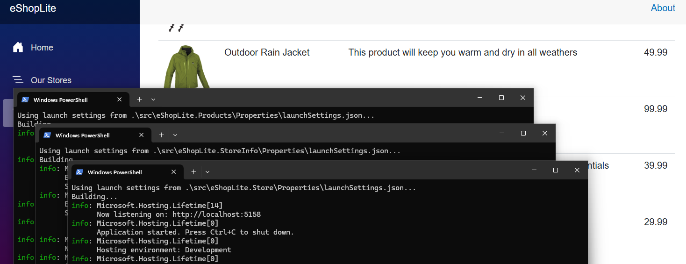

# Refactoring to microservices

You've seen how you can run a monolith app in a container and deploy it to Azure Container Apps. In this chapter you'll learn how to refactor the monolith app into microservices and deploy them to Azure Container Apps.

## Prerequisites

To run this sample app, make sure you have all the [prerequisites](../README.md#prerequisites).

## Quick tour of the microservices architecture

One of the organizing principles of microservices is to break down a monolith into smaller, more manageable services. Each service should be responsible for a specific business capability and should be independently deployable. This allows for better scalability, maintainability, and flexibility in the development process.

We will split up our monolith app into four smaller projects (you can find all the code in the [sample directory](./sample/src/)):

- `eShopLite.Store`: This has the same name as the monolith did, but now only contains the front-end components. It still is capable of calling the newly split out web APIs for products and store info.
- `eShopLite.Products`: New web API project where the product API and databases are hosted
- `eShopLite.StoreInfo`: New web API project where the individual retail store info API and databases are hosted
- `eShopLite.DataEntities`: New class library project for the data entities - this project is referenced from all of the other projects.

## Getting Started

### Get the repository root

> 📝**NOTE:**
> 
> To simplify the copy paste of the commands that sometimes require an absolute path, we will be using the variable `REPOSITORY_ROOT` to keep the path of the root folder where you cloned/downloaded this repository. The command `git rev-parse --show-toplevel` returns that path.

If you're running on a linux or Mac-based machine or are using bash, run the following:

```bash
# bash/zsh
REPOSITORY_ROOT=$(git rev-parse --show-toplevel)
```

Otherwise if you are using Windows and PowerShell, run this:

```powershell
# PowerShell
$REPOSITORY_ROOT = git rev-parse --show-toplevel
```

### Run all the microservics locally

Our end goal is to containerize all of these applications and deploy them to Azure Container Apps. But before we do that, let's run them locally to make sure everything is working as expected.

To build and run this entire solution on your local machine, run the following commands in your terminal.

1. Change to the current sample's directory.

    ```bash
    cd $REPOSITORY_ROOT/4-microservices/sample
    ```

1. Build the solution.

    ```bash
    dotnet restore && dotnet build
    ```

1. From the command line it can be a pain to start 3 projects individually. To make things easier, you can copy/paste one of these 2 scripts to help you.

    **PowerShell**
    ```powershell
    Start-Process powershell -ArgumentList "dotnet run --project ./src/eShopLite.Products"
    Start-Process powershell -ArgumentList "dotnet run --project ./src/eShopLite.StoreInfo"
    Start-Process powershell -ArgumentList "dotnet run --project ./src/eShopLite.Store"
    ```

    > 📝**NOTE:** You'll probabably get a warning asking you if you want to paste multiple lines at once, just click yes. 
    >
    > Also don't forget to hit **ENTER** after the last line in the original terminal window to run the last command.

    **Bash**
    ```bash
    dotnet run --project ./src/eShopLite.Products &
    dotnet run --project ./src/eShopLite.StoreInfo &
    dotnet run --project ./src/eShopLite.Store &
    ```

1. A browser should open and display `http:localhost:5158`, if it doesn't, go ahead and navigate there. You should see the main eShopLite front-end website. And if you click on **Our Stores** or **Products** from the navigation menu, it will load the respective data from the microservices.

    

## Containerizing the microservices

We've created 3 Dockerfiles for you that take care of containerizing its respective microservice application: **Dockerfile.products**, **Dockerfile.storeinfo** and **Dockerfile.store**. 

### Exploring the Dockerfiles

The Docker files are located directly under the `/sample` directory.

Open up any one of the Dockerfiles. You'll see that it copies both its own project and the **eShopLite.DataEntities** project to the container. This is because each top-level microservice projects depend on **eShopLite.DataEntities** project.

Here's a sample from the **Dockerfile.products** file:

```dockerfile
...

FROM mcr.microsoft.com/dotnet/sdk:9.0-alpine AS build

COPY ./src/eShopLite.Products /source/eShopLite.Products
COPY ./src/eShopLite.DataEntities /source/eShopLite.DataEntities
# any other project dependencies would be listed here as well

...
```

Another interesting thing to note is the **Dockerfile.storeinfo** and **Dockerfile.products** both create an empty file that will eventually hold their respective SQLite database.

```dockerfile

...

RUN touch /app/StoreInfo.db
# or RUN touch /app/Products.db for the Dockerfile.products

...

```

The rest of the Dockerfile is pretty standard. It builds the project and specifies and entrypoint to the applications.

### Updating where the front-end finds the APIs

The front-end application (eShopLite.Store) needs to know where to find the APIs for products and store info. Before it was using the launch URLs from the API's **launchSettings.json** file, but now that we are running the APIs in separate containers, we need to update the URLs to point to the correct container names.

1. Move to the **eShopLite.Store** directory.

    ```bash
    cd $REPOSITORY_ROOT/4-microservices/sample/src/eShopLite.Store
    ```

1. Open **appsettings.json** and update the `ProductsApi` and `StoreInfoApi` URLs to point to the new API endpoints. The URLs should be as follows:

    ```json
    {
      "ProductsApi": "http://products:8080",
      "StoreInfoApi": "http://storeinfo:8080"
    }
    ```

1. Build the container image using Docker CLI.

    ```bash
    docker build -t eshoplite-products:latest  -f ./Dockerfile.products .
    docker build -t eshoplite-storeinfo:latest  -f ./Dockerfile.storeinfo .
    docker build -t eshoplite-store:latest  -f ./Dockerfile.store .
    ```

### Running the Microservice Apps in Containers

Once you have all the container images of for the microservice apps, you can run them in containers.

1. Create a network for the containers to communicate with each other.

    ```bash
    docker network create eshop-net
    ```

1. Run the following commands to run the microservice apps in containers.

    ```bash
    docker run -d -p 5228:8080 --network eshop-net --network-alias products --name products eshoplite-products:latest
    docker run -d -p 5151:8080 --network eshop-net --network-alias weather --name weather eshoplite-weather:latest
    docker run -d -p 5158:8080 --network eshop-net --network-alias store --name store eshoplite-store:latest
    ```

1. Open your browser and navigate to the eShopLite website at `http://localhost:5158` and navigate to the `/weather` and `/products` pages.

1. Run the following commands to stop the containers.

    ```bash
    docker stop store weather products
    docker rm store weather products --force
    docker rmi eshoplite-store:latest eshoplite-weather:latest eshoplite-products:latest --force
    docker network rm eshop-net --force
    ```

1. Alternatively, you can use Docker Compose to orchestrate the containers. Looking at the `docker-compose.yml` file you will see that we are defining the services for each project. We also created **links** between the services to make it easier for eshoplite-store reach the other services.

    ```bash
    docker compose up --build -d
    ```

   > **NOTE**: Make sure to update the `appsettings.json` file in the `eShopLite.Store` project to point to the new API endpoints.
   >
   > ```json
   > {
   >   "ProductsApi": "http://products:8080",
   >   "WeatherApi": "http://weather:8080"
   > }
   > ```

1. Open your browser and navigate to the eShopLite website at `http://localhost:5158` and navigate to the `/weather` and `/products` pages.

1. Run the following commands to stop the containers.

    ```bash
    docker compose down --rmi local
    ```

### Deploying the Microservice Apps to ACA via Azure Developer CLI (AZD)

Once you're happy with the microservice apps running in a container, you can deploy it to ACA through Azure Developer CLI (AZD).

1. Make sure that you're in the `ep04` directory.

    ```bash
    cd $REPOSITORY_ROOT/ep04
    ```

1. Initialize the Azure Developer CLI (azd) in the current directory.

    ```bash
    azd init
    ```

   > During initialization, you'll be asked to provide the environment name.

1. Once the initialization is complete, update the `azure.yaml` file with the Docker settings to use ACR remote build.

    ```yaml
    name: ep04
    metadata:
      template: azd-init@1.11.0
    services:
      eshoplite-products:
        project: src/eShopLite.Products
        host: containerapp
        language: dotnet
        # 👇👇👇 Add the docker settings below
        docker:
          path: ../../Dockerfile.products
          context: ../../
          remoteBuild: true
        # 👆👆👆 Add the docker settings above
      eshoplite-store:
        project: src/eShopLite.Store
        host: containerapp
        language: dotnet
        # 👇👇👇 Add the docker settings below
        docker:
          path: ../../Dockerfile.store
          context: ../../
          remoteBuild: true
        # 👆👆👆 Add the docker settings above
      eshoplite-weather:
        project: src/eShopLite.Weather
        host: containerapp
        language: dotnet
        # 👇👇👇 Add the docker settings below
        docker:
          path: ../../Dockerfile.weather
          context: ../../
          remoteBuild: true
        # 👆👆👆 Add the docker settings above
    ```

1. Because the .NET container app uses the target port number of `8080`, you need to update the `infra/resources.bicep` file to use the correct target port number. This time, you have three ACA instances: `eshoplite-products`, `eshoplite-store` and `eshoplite-weather`. Therefore, you will have to update three locations of the `ingressTargetPort` and `PORT` values.

    ```bicep
    ...
     // ingressTargetPort: 80
     ingressTargetPort: 8080
    ...
        {
            name: 'PORT'
            // value: '80'
            value: '8080'
        }
    ```

1. Also the Store app should be able to discover both Products and Weather APIs. Therefore, also update the `infra/resources.bicep` for the service discovery.

    ```bicep
    module eshopliteStore 'br/public:avm/res/app/container-app:0.8.0' = {
      name: 'eshopliteStore'
      ...
            env: union([
              {
                name: 'APPLICATIONINSIGHTS_CONNECTION_STRING'
                value: monitoring.outputs.applicationInsightsConnectionString
              }
              {
                name: 'AZURE_CLIENT_ID'
                value: eshopliteStoreIdentity.outputs.clientId
              }
              {
                name: 'PORT'
                value: '8080'
              }
              // 👇👇👇 Add the environment variables below
              {
                name: 'ProductsApi'
                value: 'https://${eshopliteProducts.outputs.fqdn}'
              }
              {
                name: 'WeatherApi'
                value: 'https://${eshopliteWeather.outputs.fqdn}'
              }
              // 👆👆👆 Add the environment variables above
            ],
      ...
    }
    ```

1. Provision and deploy the microservice apps to ACA.

    ```bash
    azd up
    ```

   > While executing this command, you'll be asked to provide the Azure subscription ID and location.

1. Open your web browser and navigate to the URLs provided by the ACA instances on the screen to see the microservice apps running in ACA.

## Clean up the deployed resources

To clean up the resources, run the following command:

```bash
azd down --force --purge
```