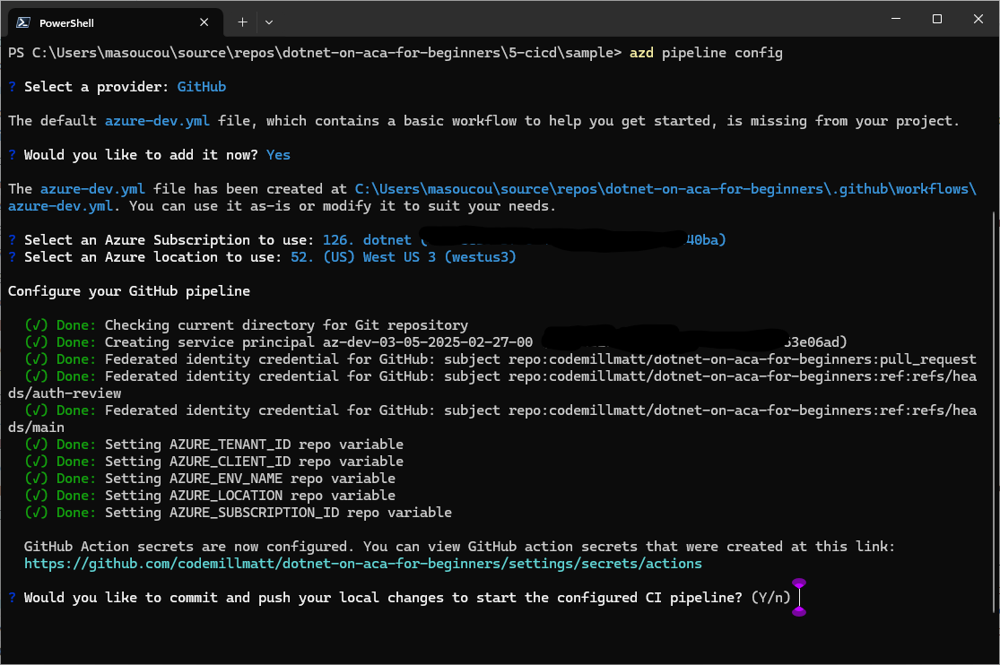

# Creating a CI/CD pipeline with azd

In this chapter, we'll learn how to create a Continous Integration/Continous Deployment (CI/CD) pipeline. 

We'll create a GitHub Actions workflow that builds, pushes, and deploys the Docker images to our Azure Container App environment. The code in this chapter is based on the [Chapter 4 microservice's code](../4-microservices/) and can be found in the [sample directory](./sample/).

## Prerequisites

To run this sample app, make sure you have all the [prerequisites](../README.md#prerequisites).

## Getting Started

1. Getting the Repository Root

	To simplify the copy paste of the commands that sometimes required an absolute path, we will be using the variable `REPOSITORY_ROOT` to keep the path of the root folder where you cloned/ downloaded this repository. The command `git rev-parse --show-toplevel` returns that path.

	```bash
	# Bash/Zsh
	REPOSITORY_ROOT=$(git rev-parse --show-toplevel)
	```

	```powershell
	# PowerShell
	$REPOSITORY_ROOT = git rev-parse --show-toplevel
	```


## Initialize Azure Developer CLI (azd) environment

1. Move to the **sample** directory in the this chapter's directory.

    ```bash
    cd $REPOSITORY_ROOT/5-cicd/sample
    ```

1. Initialize the Azure Developer CLI (azd) in the current directory.

    ```bash
    azd init
    ```

   > 📝**NOTE**: During initialization, you'll be asked to provide the environment name, remember this as it will be used to create the resource group and other resources in Azure.

## Creating a CI/CD Pipeline with azd

You can use the Azure Developer CLI to create a CI/CD pipeline for your application. The pipeline will be created using GitHub Actions. Let's see how to do that.

1. To create the configuration file that will define the pipeline, run the following command:

    ```bash
    azd pipeline config
    ```

   While executing this command, you'll be asked a few questions:
       1. When asked, select GitHub.
       1. Accept to create the `azure-dev.yml` file.
       1. Select the Azure subscription and location you want to use.
       1. The last question will be if **Would you like to commit and push your local changes to start the configured CI pipeline?** reply with **n**, we have some changes to do before we can commit the files

    

1. Open the **azure-dev.yml** file in the **.github/workflows** directory in your code editor. The `.github` folder is at the root of your repository. Because this course contains many solutions in many different subdirectories, we need to specify the exact solution we to deploy. Find the steps named `Provision Infrastructure` and `Deploy Application` to specify the path to the solution in this chapter's sample directory. Update the steps to look like this:

    ```yaml
      - name: Provision Infrastructure
        run: |
            pushd 5-cicd/sample
            azd provision --no-prompt
            popd
        env:
          AZD_INITIAL_ENVIRONMENT_CONFIG: ${{ secrets.AZD_INITIAL_ENVIRONMENT_CONFIG }}

      - name: Deploy Application
        run: |
            pushd 5-cicd
            azd deploy --no-prompt
            popd
    ```

    > ⚠️**INFO** 
    > Make sure to respect the extact indentation and spacing. The `pushd` and `popd` commands are used to change the directory to the **5-cicd** folder and then return to the previous folder.

    > 💡**TIP** 
    > Validate that the step `Install azd` is using `Azure/setup-azd@v2`. If you are still using `v1` the deployment will fail. You should update AZD CLI, and change the version in the file.

1. Commit the changes to the repository. And push the changes to GitHub. You can use any Git user interface you like or the git command line: 

    ```bash
    git add .
    git commit -m "Add CI/CD pipeline"
    git push origin
    ```

    Upon the push, the GitHub Actions workflow will be triggered.

## Examine the GitHub Actions workflow

The deployment will take a few minutes. You can monitor the pipeline status in the tab `Actions` in your Github page. The URL should have been printed in the console after the `azd pipeline config` command. (ex: https://github.com/FBoucher/dotnet-on-aca-5-cicd/actions) 

> ⚠️**INFO**
> If the deployment fails because .NET SDK 9 is not installed, you can edit the `azure-dev.yml`. Add the a step between `Checkout` and `Install azd` to install the .NET SDK 9.0.

```yaml
    steps:
    - name: Checkout
        uses: actions/checkout@v4

    // 👇👇👇 Add the step Setup .NET below
    - name: Setup .NET
        uses: actions/setup-dotnet@v4
        with:
        dotnet-version: 9.0.x
    // 👆👆👆 Add the step Setup .NET above

    - name: Install azd
        uses: Azure/setup-azd@v1.0.0
```


While it's deploying let's examine the `.github/workflows/azure-dev.yml` file in your code editor.

1. Triggering the workflow

    The workflow will be triggered when a push is made to the `main` branch. As we can see in the `on` section of the workflow file:

    ```yaml
    on:
      push:
        # Run when commits are pushed to mainline branch (main or master)
        # Set this to the mainline branch you are using
        branches:
          - main
    ```

2. How permissions work

    The workflow uses the `Azure/setup-azd@v2.0.0` action to authenticate with Azure. The action uses the `AZD_INITIAL_ENVIRONMENT_CONFIG` secret that was created in the previous step with the `azd pipeline config` command.
    The secret is saved in the repository settings under `Settings` -> `Secrets and variables` -> `Actions`. You won't be able to see the value of the secret, but you can update it if needed.

3. What the workflow does

    The workflow has the following steps:

    - `Checkout`: This step checks out the code from the repository.
    - (optionally) `Setup .NET`: This step installs the .NET SDK 9.0.
    - `Install azd`: This step installs the Azure Developer CLI (azd) on the runner.
    - `Log in with Azure (Federated Credentials)`: This step logs in to the Azure subscription.
    - `Provision Infrastructure`: This step provisions the infrastructure using the Bicep file.
    - `Deploy Application`: This step deploys the microservices to Azure Container Apps. like we did in the previous episode.


## Look at the deployed resources

1. Open your web browser and navigate to the Azure Portal (https://portal.azure.com/). Open the resource group with the name matching `rg` + the env name used with azd init (ex: rg-5-cicd). 
1. Open the `eshoplite-store` Container App and click on the `Application Url`, at the top right of the page, to see the deployed store.

## Update the code and see the changes

1. Open the `src\eShopLite.Store\Components\Pages\Home.razor` file, and change the welcome message to something else.
1. Commit and push the changes to the `main` branch.

    ```bash
    git add .
    git commit -m "Update welcome message"
    git push
    ```

1. Open the **Actions** tab in your GitHub repository to see the workflow running. Once the workflow is completed, refresh the store page to see the changes.

## Clean up the deployed resources

You are running in Azure and depending on your subscription may be incurring costs. Run the following command to delete everything you just provisioned. (Unless you plan on proceeding to Chapter 6, in which case you can skip this step.)

```bash
azd down --force --purge
```

## Learn more

**TODO: ADD LEARN MORE RESOURCES**

## Up next

In the next chapter, we'll learn how to optimize the cost of our Azure Container Apps.

👉 [Chapter 6: Cost optimization]