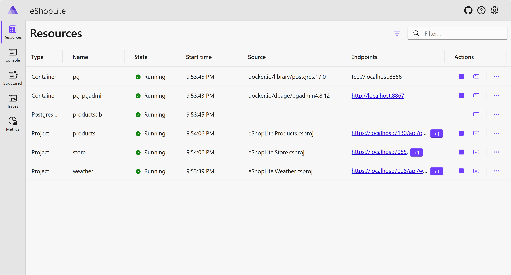

# Easier orchestration with .NET Aspire

This sample app demonstrates how to easily orchestrate MSA apps and deploy them to [Azure Container Apps (ACA)](https://learn.microsoft.com/azure/container-apps/overview), using [.NET Aspire](https://aka.ms/dotnet-aspire).

## Prerequisites

To run this sample app, make sure you have all the [prerequisites](../README.md#prerequisites).

## Quick tour of the solution

All the apps are copied from [`ep04`](../ep04/) except Dockerfiles and Docker Compose files. The solution contains the following projects:

- `eShopLite.Store`: The frontend web app using Blazor.
- `eShopLite.Products`: The backend API app that takes care of products with [SQLite](https://www.sqlite.org/).
- `eShopLite.Weather`: The backend API app that looks after the weather.
- `eShopLite.DataEntities`: The class library that contains data entities consumed by all the other apps.

## Getting Started

During this episode, we will introduce .NET Aspire to orchestrate the MSA apps. We will also replace the existing SQLite database with a containerized [PostgreSQL](https://www.postgresql.org/) one. You will start from the [`ep08/1_start`](./1_start/) directory and see the final result at the [`ep08/2_complete`](./2_complete/) directory.

### Getting the Repository Root

To simplify the copy paste of the commands that sometimes required an absolute path, we will be using the variable `REPOSITORY_ROOT` to keep the path of the root folder where you cloned/downloaded this repository. The command `git rev-parse --show-toplevel` returns that path.

```bash
# Bazh/Zsh
REPOSITORY_ROOT=$(git rev-parse --show-toplevel)
```

```powershell
# PowerShell
$REPOSITORY_ROOT = git rev-parse --show-toplevel
```

### Running the Microservice Apps Locally

To build and run this entire solution on your local machine, run the following commands in your terminal.

1. Make sure that you're in the `ep08/1_start` directory.

    ```bash
    cd $REPOSITORY_ROOT/ep08/1_start
    ```

1. Build the solution.

    ```bash
    dotnet restore && dotnet build
    ```

1. Open three terminals. Each terminal runs each project respectively.

    ```bash
    # Terminal 1
    cd $REPOSITORY_ROOT/ep08/1_start
    dotnet watch run --project ./src/eShopLite.Products
    ```

    ```bash
    # Terminal 2
    cd $REPOSITORY_ROOT/ep08/1_start
    dotnet watch run --project ./src/eShopLite.Weather
    ```

    ```bash
    # Terminal 3
    cd $REPOSITORY_ROOT/ep08/1_start
    dotnet watch run --project ./src/eShopLite.Store
    ```

   > **NOTE**: If new terminals don't recognize `$REPOSITORY_ROOT` variable, run the command again to get the path.

1. Open a browser and navigate to `http://localhost:5158` to see the app running. Then navigate to `/weather` and `/products` to see both pages are properly working.

1. To stop the apps, press `Ctrl+C` in each terminal.

### Running the Microservice Apps with .NET Aspire Locally

If you simply want to run the microservice apps that already applied .NET Aspire integration, it's already prepared for you at the `ep08/2_complete` directory. This solution has also replaced the SQLite database with a containerized PostgreSQL one.

> **NOTE**: If you want to see how .NET Aspire is integrated, check out the [optional learning](./extra.md) page.

1. Make sure that Docker Desktop is running on your machine.

1. Make sure that you're in the `ep08/2_complete` directory.

    ```bash
    cd $REPOSITORY_ROOT/ep08/2_complete
    ```

1. Run the following command to build and run the applications.

    ```bash
    dotnet watch run --project ./src/eShopLite.AppHost
    ```

1. Open a browser and navigate to `https://localhost:17287` to see the .NET Aspire dashboard is up and running.

   

   As you can see the dashboard, the Products API app now uses PostgreSQL instead of SQLite.

1. Click the "View details" menu of the Products API app and see the connection string of the PostgreSQL database.

   

1. Click the "View details" menu of the Store app and see the connection strings to both Product API and Weather API apps.

   

1. Click the Store app link to see the app running. Then navigate to `/weather` and `/products` to see both pages are properly working.

1. To stop the apps, press `Ctrl+C` in a terminal.

### Deploying the Microservice Apps to Azure Container Apps with .NET Aspire via Azure Developer CLI (AZD)

Once you're happy with the .NET Aspire orchestration of all the microservice apps, you can deploy it to ACA through Azure Developer CLI (AZD).

1. Make sure that you're either in the `ep08/2_complete` directory.

    ```bash
    cd $REPOSITORY_ROOT/ep08/2_complete
    ```

1. You won't be able to see the `infra` directory because it's all managed by .NET Aspire. Instead, open the `azure.yaml` file and see the configurations that only contains the `eShopLite.AppHost` project.

    ```yml
    # yaml-language-server: $schema=https://raw.githubusercontent.com/Azure/azure-dev/main/schemas/v1.0/azure.yaml.json
    
    name: 2-complete
    services:  
      app:
        language: dotnet
        project: ./src/eShopLite.AppHost/eShopLite.AppHost.csproj
        host: containerapp
    ```

1. Provision and deploy the microservice apps to ACA.

    ```bash
    azd up
    ```

   > While executing this command, you'll be asked to provide the environment name, Azure subscription ID and location.

1. Once the deployment is over, you'll see the URLs of the deployed microservice apps on the screen.

   

   Please note that not all the apps are accessible from the public internet because they have `.internal` in the URL while the Store app doesn't have it. The Store app is the only one that has external HTTP endpoints. You will also have the Aspire Dashboard URL.

1. Open your web browser and navigate to the Store app and see the app is up and running on ACA. Then navigate to `/weather` and `/products` to see both pages are properly working.

1. Navigate to the Aspire Dashboard URL to see the status of the deployed apps as well as all the connection strings that are automatically configured by .NET Aspire. Please note that you'll be asked to login to access the dashboard.

## Optional Learning

If you want to see how .NET Aspire is integrated, check out the [optional learning](./extra.md) page.

## Clean up the deployed resources

To clean up the resources, run the following command:

```bash
azd down --force --purge
```
