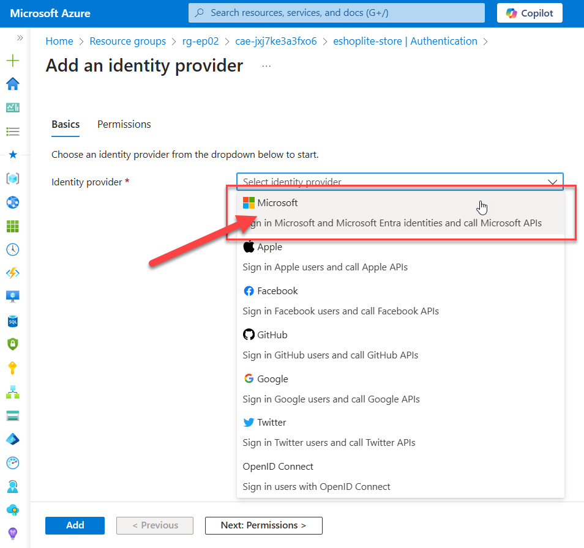

# EP03: Authenticating App on ACA

This sample app demonstrates how to add the authentication feature to [Azure Container Apps (ACA)](https://learn.microsoft.com/azure/container-apps/overview) without changing the app code.

## Prerequisites

For this episode we will be using the App deployed from the previous [ep02](../ep02/README.md). Note that no code need to be changed to add this authentication feature.

## Secure the App in a few clicks

The app is now deployed, but it's not secure. Navigate to the [Azure Portal](https://portal.azure.com/), and find the Resource Group you just deployed (ex: rg-ep02). In this resource group, open the `Container Apps Environment` 


From there select the Container App `eshoplite-store`. 


From the left menu, select Authentication and click the Add identity provider.


You can choose between multiple providers, but let's use Microsoft since it's deploy in Azure and you are already logged in. 



Once Microsoft is choosen, you will see many configuration options. Select the recomended Client secret expiration (ex: 180 days).


You can keep all the other default settings. Click Add. After a few seconds you should see a notification in the top right corner that the identity provider was added successfully.

Voila! Your app is now secure.

Next time you will navigate to the app, you will be prompt a to login with your Microsoft account. Notice that your entired app is protected. No page is accessible without authentication.


The first time you get loged in, you will have a Permissions requested screen. Note that it is `eshoplite-store`, check the consent checkbox and click Accept.


## Built-in Authentication on ACA

The built-in authentication feature of ACA is simple and powerful way to secure your applications with minimal effort. Here are some key points to remember:

- You don't need to change the existing app code to add this authentication feature.
- This built-in authentication feature of ACA protects your entire application, not individual pages.

For more details about the built-in authentication feature of ACA, see [Authentication and authorization in Azure Container Apps](https://learn.microsoft.com/azure/container-apps/authentication).

## Optional Learning

- [Extend the authentication and authorization feature for Azure Container Apps](../ep03-1/README.md)
- [Authentication and authorization in Azure Container Apps](https://learn.microsoft.com/azure/container-apps/authentication)
- [Enable authentication and authorization in Azure Container Apps with Microsoft Entra ID](https://learn.microsoft.com/azure/container-apps/authentication-entra)


## Clean up the deployed resources

To clean up the resources, run the following command:

```bash
azd down --force --purge
```
